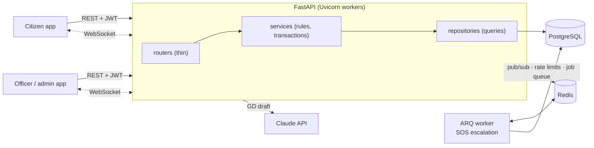

# Rokkha

[](https://github.com/AsadShibli/rokkha/actions/workflows/ci.yml)

**Rokkha** (রক্ষা, "protection") is a public-safety dispatch and Online GD backend. A citizen
presses SOS, the nearest available officer is assigned automatically, both sides follow it
live, and citizens can file a General Diary (GD) that moves through a review workflow.

**Stack:** FastAPI · SQLAlchemy 2.0 (async) · Alembic · PostgreSQL 16 · Redis · ARQ ·
WebSockets · pytest · Docker · GitHub Actions

## The problem

Emergency calls are still routed by hand: someone answers, works out which station is
closest, phones around for a free officer, and the caller has no idea whether help is coming.
Minor complaints mean a trip to the station to write a paper GD. Rokkha automates the parts
that don't need a human (nearest free officer, numbering, status tracking) and keeps the
humans for review.

## What it does

| Area | Highlights |
|---|---|
| **Auth** | JWT access (15 min) + refresh (7 days) with rotation; reuse of a rotated token is rejected; logout revokes one session; role guards for `citizen`, `officer`, `station_admin`, `super_admin` |
| **Dispatch** | `POST /incidents/sos` assigns the nearest reachable officer city-wide (Haversine in SQL), locked with `FOR UPDATE SKIP LOCKED` so two simultaneous SOS calls never get the same officer; no free officer → stays `pending` |
| **Lifecycle** | `pending → assigned → en_route → resolved`, `cancelled`, admin reassign; anything else is `409 INVALID_TRANSITION`; every change is an append-only event |
| **Escalation** | ARQ job: an SOS not accepted in 2 minutes goes to the next-nearest officer who hasn't had it, else back to pending |
| **Live updates** | `WS /ws/incidents/{id}`: status changes and officer location, fanned out through Redis pub/sub so it works across workers |
| **Online GD** | Numbers like `DHA-GUL-2026-000001` (per station, per year, no duplicates under concurrency); `submitted → under_review → approved/rejected` |
| **AI draft** | `POST /gds/ai-draft` turns a Bangla or English complaint into a suggested GD (Claude, structured output), validated and never saved |
| **Ops** | Dashboard stats, SOS rate limit (429), health checks, consistent error JSON, Docker, CI |

## Quick start

Requires Docker.

```bash
docker compose up --build -d                     # Postgres, Redis, API, worker (migrations run on start)
docker compose exec api python -m scripts.seed   # demo data; prints every login
```

Open **http://localhost:8000/docs**, call `POST /auth/login`, copy `access_token`, click
**Authorize**. Or import [`postman/rokkha.postman_collection.json`](postman/rokkha.postman_collection.json)
and run it top to bottom: it walks the whole demo and saves tokens and ids as it goes.

### Seeded logins (password `rokkha1234`)

| Role | Phone | Who |
|---|---|---|
| super admin | `+8801711000000` | Control Room |
| station admin | `+8801711000001` / `…02` / `…03` | Gulshan / Badda / Tejgaon |
| officer | `+8801722000001` … `…06` | two per station; one on duty each |
| citizen | `+8801733000001` … `…05` | |

On-duty officers count as reachable only if seen in the last 10 minutes: send
`PATCH /officers/me/location` as the officer, or run `docker compose exec api python -m scripts.seed --touch`.

## Architecture



- **Routers** only parse input, pick the role guard, call one service method and shape the response.
- **Services** hold every business rule and own the transaction (`commit` happens there).
- **Repositories** are queries only; role scoping is a SQL filter built once (`visibility(user)`).
- **Models** carry the database guarantees: CHECK constraints, partial unique indexes, FKs.

### SOS, step by step

```mermaid
sequenceDiagram
    participant Citizen
    participant API
    participant DB as PostgreSQL
    participant Redis
    participant Worker
    participant Officer
    Citizen->>API: POST /incidents/sos {lat, lng}
    API->>API: rate limit (Redis), open-SOS check
    API->>DB: INSERT incident (pending) + event
    API->>DB: SELECT nearest reachable officer FOR UPDATE SKIP LOCKED
    API->>DB: officer → busy, incident → assigned, event; COMMIT
    API->>Redis: enqueue escalation check (+2 min)
    API-->>Citizen: 201 assigned + officer
    Citizen-->>API: WS /ws/incidents/{id}
    Officer->>API: POST /incidents/{id}/accept
    API->>DB: assigned → en_route; COMMIT
    API->>Redis: PUBLISH incident:{id}
    Redis-->>Citizen: status: en_route (via WebSocket)
    Worker->>DB: (2 min later) still assigned? no → nothing to do
```

## Data model

Eight tables: `users`, `stations`, `officers`, `incidents`, `incident_events`, `gds`,
`gd_sequences`, `refresh_tokens`. Diagram in [docs/ERD.md](docs/ERD.md); every column,
constraint, index and ON DELETE rule in [docs/database_schema.md](docs/database_schema.md).

## Key decisions

- **FastAPI + async SQLAlchemy.** Most request time is waiting on Postgres and Redis; async
  serves many of those at once. CPU-heavy bcrypt runs in a thread so it can't block the loop.
- **Correctness lives in the database, not only in Python.**
  - `FOR UPDATE SKIP LOCKED` when picking an officer: a parallel SOS skips the locked row and
    takes the next officer instead of waiting or double-booking.
  - Partial unique indexes: one open SOS per citizen, one active incident per officer. A race
    that slips past the service check still hits the index and becomes a clean 409.
  - GD numbers come from an `INSERT … ON CONFLICT DO UPDATE … RETURNING` counter in the same
    transaction, so parallel filings get consecutive, unique numbers and a failed insert gives
    its number back.
- **State machine as data.** Each action lists the statuses it may start from; everything else
  is `409 INVALID_TRANSITION`. Every change writes an event, so the timeline is an audit trail.
- **Out-of-scope = 404, wrong role = 403.** Another station's incident behaves as if it doesn't
  exist, which doesn't leak ids.
- **Refresh token rotation with a row lock.** Only the `jti` is stored; using a refresh token
  locks its row and revokes it, so the same token can never mint two sessions (tested with a
  3-way race).
- **Live updates through Redis pub/sub.** Any worker can publish; any worker holding the socket
  forwards it. Publishing happens after commit and is best-effort: the database stays the source
  of truth.
- **One error shape** for everything (validation, auth, business rules, unknown routes):
  `{"error": {"code", "message", "details"}}`.
- **Enums as `varchar` + `CHECK`**, not native Postgres enums, so adding a value is an ordinary
  migration.

## Tests and CI

```bash
docker compose up -d db redis
uv sync
uv run pytest            # 141 tests
uv run ruff check . && uv run ruff format --check .
```

- The test database is built by running the real Alembic migrations, so every run also tests
  them; CI also runs `alembic check` so models and migrations can't drift.
- Each test runs inside a transaction that is rolled back.
- Race tests commit for real on separate connections: two SOS / one officer, double-tap SOS,
  a refresh token used three times at once, five GDs filed in parallel.
- WebSocket tests run the full app with real Redis.
- CI (GitHub Actions): lint, format check, migrations, tests against Postgres 16 + Redis, Docker build.

## Local development without Docker for the app

```bash
cp .env.example .env           # PowerShell: Copy-Item .env.example .env
docker compose up -d db redis  # Postgres on :5433, Redis on :6379
uv sync
uv run alembic upgrade head
uv run python -m scripts.seed
uv run uvicorn app.main:app --reload
uv run arq app.workers.main.WorkerSettings   # second terminal: SOS escalation
```

## Deploying

One image for the API and the worker. Step-by-step guides for Railway (recommended) and a
Render Blueprint are in [docs/DEPLOY.md](docs/DEPLOY.md).

## Project layout

```
app/
  api/v1/        routers: auth, users, stations, officers, incidents, gds, dashboard, ws, health
  api/deps.py    current user, role guards, publisher / queue / rate limiter injection
  core/          settings, security (JWT, bcrypt), errors, local time
  db/            engine/session, base + naming convention, constraint -> error mapping
  models/        SQLAlchemy models
  schemas/       Pydantic request/response models
  repositories/  queries
  services/      business rules: dispatch, incidents, GD, dashboard, realtime, AI draft
  workers/       ARQ worker + job queue
alembic/         migrations 0001-0005
scripts/         seed data, create super admin
tests/           141 tests
docs/            requirements, business rules, ERD, schema, API design, deploy
postman/         collection for the full demo
```

## Design docs

Written before the code and kept in sync with it:
[system requirements](docs/system_requirements.md) ·
[business rules](docs/business_rules.md) ·
[API design](docs/api_design.md) ·
[ERD](docs/ERD.md) ·
[database schema](docs/database_schema.md)

## Next steps

- PostGIS geography column + GiST index for nearest-officer search at larger scale
- Push notifications (Firebase) for officers who aren't on the WebSocket
- More agencies (fire, ambulance) as incident types routed to their own units
- Audit log of admin actions; CCTV / drone feed ingestion linked to incidents
