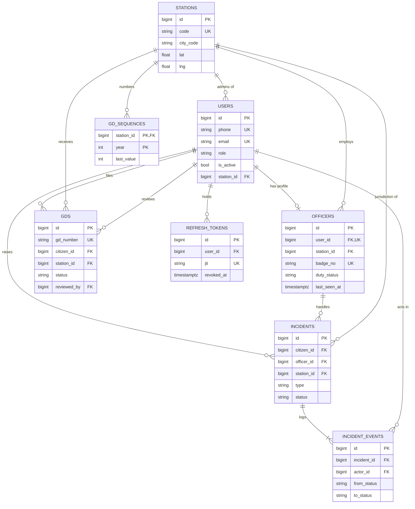

# ERD

Entities and attributes for the MVP. Constraints, types and indexes are in
[database_schema.md](database_schema.md). Every table also has `id`, `created_at`, `updated_at`.

## Entities

### users
- name
- phone
- email
- password_hash
- role (citizen / officer / station_admin / super_admin)
- is_active
- station_id (fk, station admins only)

### stations
- name
- code (e.g. KOT)
- city
- city_code (e.g. SYL, used in GD numbers)
- lat
- lng

### officers
- user_id (fk)
- station_id (fk)
- badge_no
- rank
- duty_status (off_duty / available / busy)
- last_lat
- last_lng
- last_seen_at

### incidents
- citizen_id (fk -> users)
- officer_id (fk -> officers, empty while pending)
- station_id (fk, jurisdiction = nearest station)
- type (sos / report)
- status (pending / assigned / en_route / resolved / cancelled)
- lat
- lng
- description
- assigned_at
- accepted_at
- resolved_at
- cancelled_at

### incident_events
- incident_id (fk)
- actor_id (fk -> users, empty when the system acted)
- officer_id (fk -> officers, the officer assigned by this event, if any)
- from_status (empty for the creation event)
- to_status
- note

### gds
- gd_number
- citizen_id (fk -> users)
- station_id (fk)
- category (lost_item / lost_document / missing_person / threat / harassment / other)
- title
- details
- incident_date
- status (submitted / under_review / approved / rejected)
- reviewed_by (fk -> users)
- reviewed_at
- review_note

### gd_sequences
- station_id (fk, part of pk)
- year (part of pk)
- last_value

### refresh_tokens
- user_id (fk)
- jti
- expires_at
- revoked_at

## Relationships

- stations 1 — 0..N users (only station admins carry station_id)
- users 1 — 0..1 officers (an officer user has exactly one profile)
- stations 1 — 0..N officers
- users (citizen) 1 — 0..N incidents
- officers 1 — 0..N incidents (at most one *open* incident at a time)
- stations 1 — 0..N incidents
- incidents 1 — 1..N incident_events (creation is always the first event)
- users 1 — 0..N incident_events (as actor)
- users (citizen) 1 — 0..N gds
- stations 1 — 0..N gds
- users (station admin) 1 — 0..N gds (as reviewer)
- stations 1 — 0..N gd_sequences (one row per year)
- users 1 — 0..N refresh_tokens

## Diagram

